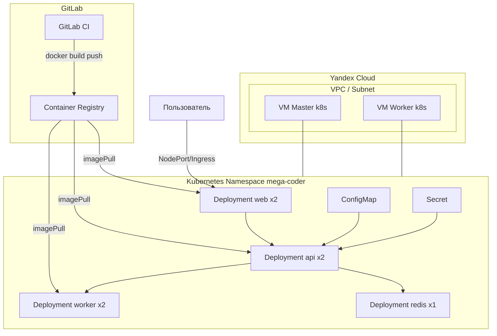

# Отчёт по курсу DevOps — проект «MEGA CODER»

**Выполнил:** Сергей  
**Репозиторий:** https://gitlab.com/Mega.93/deveps-mega-coder  

---

## 0. Где лежит описание и как сдавать отчёт

| Документ | Назначение |
|----------|------------|
| **README.md** | Краткое описание репозитория и быстрые команды. |
| **REPORT.md** | Полный отчёт по требованиям курса (этот файл). |
| **PDF** | ТЗ допускает PDF или MD: получите PDF экспортом из редактора Markdown (например VS Code с расширением PDF, Typora) или командой `pandoc REPORT.md -o REPORT.pdf`, если установлен Pandoc. В репозиторий PDF коммитить необязательно. |

---

## 1. Описание приложения и архитектуры

### 1.1 Назначение

Демонстрационный многосервисный стек **MEGA CODER** имитирует минимальный продукт: веб-интерфейс обращается к backend API, API использует **Redis** и вызывает вспомогательный сервис **worker**. Все сервисы конфигурируются через **переменные окружения** и разворачиваются в **Kubernetes** из **Helm-чарта**. Образы собираются в **GitLab CI/CD** и публикуются в **GitLab Container Registry**.

### 1.2 Состав сервисов (≥ 3 по ТЗ)

| Сервис | Роль | Технология | Проверка работоспособности |
|--------|------|------------|----------------------------|
| **web** | Frontend + reverse proxy к API | Nginx (Alpine), статика HTML | HTTP `/` |
| **api** | Backend REST | Python 3.12, FastAPI, Uvicorn | HTTP `/health`, `/api/info` |
| **worker** | Вспомогательный HTTP-микросервис | Python 3.12, FastAPI | HTTP `/health` |
| **redis** | Кэш/брокер данных для API | Официальный образ Redis | `redis-cli ping` в probe |

Связи: браузер → **web** → `/api/*` проксируется на **api**; **api** → **redis** (ключ-значение) и **worker** (HTTP `/health` в проверке `/ready`).

### 1.3 Архитектурная схема инфраструктуры



**Terraform** создаёт VPC, подсеть, security group и две ВМ (master/worker). На нодах разворачивается Kubernetes (kubeadm/k3s/microk8s — по методичке курса; в репозитории не фиксируется установка кластера, только инфраструктура под неё). **Ansible** применяет **вариант A** (харднинг ОС). **Helm** выкатывает приложение в namespace `mega-coder`.

---

## 2. Инструкция по запуску

### 2.1 Предусловия

- Аккаунт **Yandex Cloud**, CLI `yc` и/или токен для Terraform.
- Установлены: **Terraform ≥ 1.3**, **Ansible**, **kubectl**, **helm ≥ 3**, **Docker** (для локальных сборок).
- Кластер **Kubernetes** с рабочими нодами (1 master + 1 worker по ТЗ топологии).
- Проект в **GitLab** с включённым Container Registry и **GitLab Runner** с Docker (dind) для стадий build.

### 2.2 Инфраструктура (Terraform)

1. Скопируйте `terraform/terraform.tfvars.example` → `terraform/terraform.tfvars`, заполните `cloud_id`, `folder_id`.
2. Выполните:

```bash
cd terraform
terraform init
terraform plan
terraform apply
```

3. Сохраните **outputs** (IP адреса). По требованию ТЗ **состояние** может храниться в репозитории (`terraform.tfstate`); не публикуйте вместе с ним секреты облака.

### 2.3 Харднинг нод (Ansible)

1. Установите коллекции: `ansible-galaxy collection install -r ansible/requirements.yml`.
2. Создайте `ansible/inventory/hosts.ini` из примера, вставьте IP из Terraform output.
3. Запуск:

```bash
cd ansible
ansible-playbook -i inventory/hosts.ini site.yml
```

**Важно:** до Ansible должен быть настроен SSH по ключу; после плейбука парольный вход будет отключён — не теряйте ключ.

### 2.4 Kubernetes и приложение

1. Установите kubeconfig на машину, с которой запускаете `kubectl`/`helm`.
2. Создайте секрет для Registry (аналогично job `deploy_helm` в `.gitlab-ci.yml`) или выполните деплой через GitLab.
3. Локальный пример Helm:

```bash
export REG=registry.gitlab.com/<group>/<project>
export TAG=dev-local
docker build -t "$REG/api:$TAG" ./api && docker push "$REG/api:$TAG"
docker build -t "$REG/web:$TAG" ./web && docker push "$REG/web:$TAG"
docker build -t "$REG/worker:$TAG" ./worker && docker push "$REG/worker:$TAG"

helm upgrade --install mega ./helm/mega-coder -n mega-coder --create-namespace \
  --set global.imageRegistry="$REG" \
  --set images.api.tag="$TAG" \
  --set images.web.tag="$TAG" \
  --set images.worker.tag="$TAG" \
  --set-json 'imagePullSecrets=[{"name":"gitlab-registry"}]' \
  --set secrets.appSharedSecret="local-demo"
```

4. Проверка:

```bash
kubectl get pods -n mega-coder
kubectl port-forward -n mega-coder svc/<release>-mega-coder-web 8080:8080
# открыть http://127.0.0.1:8080
```

Имя сервиса web зависит от имени Helm-релиза (по умолчанию `mega-mega-coder-web`).

### 2.5 Мониторинг

См. [monitoring/README.md](./monitoring/README.md): установка **kube-prometheus-stack** и **loki-stack**, импорт/настройка дашбордов.

---

## 3. Переменные окружения и их описание

### 3.1 Сервис `api`

| Переменная | Назначение | Значение по умолчанию |
|------------|------------|------------------------|
| `SERVICE_NAME` | Имя в ответах `/health` | `api` (в K8s подставляется из ConfigMap) |
| `REDIS_URL` | URL Redis | В Helm: `redis://<release>-redis:6379/0` |
| `WORKER_BASE_URL` | Базовый URL worker | `http://<release>-worker:8081` |
| `APP_SHARED_SECRET` | Пример секрета из Kubernetes Secret | из `values.secrets.appSharedSecret` |

### 3.2 Сервис `worker`

| Переменная | Назначение | По умолчанию |
|------------|------------|----------------|
| `SERVICE_NAME` | Имя сервиса | `worker` (ConfigMap) |

### 3.3 Сервис `web` (Nginx)

| Переменная | Назначение | По умолчанию |
|------------|------------|----------------|
| `PORT` | Порт HTTP | `8080` |
| `API_UPSTREAM` | upstream для `location /api/` | В Helm: `http://<release>-api:8000` |

### 3.4 GitLab CI/CD Variables

| Имя | Тип | Назначение |
|-----|-----|------------|
| `KUBE_CONFIG` | File | kubeconfig для `kubectl`/`helm` в job deploy |
| `APP_SHARED_SECRET` | Variable (masked) | Секрет приложения в Helm `--set secrets.appSharedSecret` |

Встроенные `CI_REGISTRY`, `CI_REGISTRY_USER`, `CI_REGISTRY_PASSWORD` используются для login и `imagePullSecrets`.

---

## 4. Описание pipeline (`.gitlab-ci.yml`)

### Стадия `pre_build` — job `prepare_image_tag`

- **Действие:** формируется уникальный тег образа `IMAGE_TAG=${CI_COMMIT_SHORT_SHA}-${CI_PIPELINE_ID}` и базовый путь `REGISTRY_BASE=${CI_REGISTRY_IMAGE}`.
- **Результат:** артефакт **dotenv** `build.env` для последующих job (требование ТЗ: подготовка артефактов на pre build).

### Стадия `build` — `build_api`, `build_web`, `build_worker`

- **Действие:** сервис `docker:dind`, вход в GitLab Registry, `docker build` + `docker push` для каждого из трёх Dockerfile.
- **Соответствие ТЗ:** сборка образов и публикация в **GitLab Container Registry**.

### Стадия `deploy` — `deploy_helm`

- **Условие:** ветка `main` (можно расширить под теги).
- **Действие:** `kubectl` с `KUBECONFIG` из файловой переменной; создание namespace; создание/обновление `docker-registry` secret; **`helm upgrade --install`** чарта `helm/mega-coder` с `--set` для тегов и registry.
- **Соответствие ТЗ:** деплой **Helm** в кластер, идемпотентность `upgrade --install`.

---

## 5. Docker (требования ТЗ)

- **Multi-stage:** этап `builder` (установка зависимостей) и этап `runtime` (Alpine/slim).
- **Не root:** пользователи `app` / `nginx` + `su-exec` для web.
- **`.dockerignore`:** уменьшение контекста в `api`, `web`, `worker`.
- **HEALTHCHECK:** в образах API, worker, web.
- **Версии базовых образов** зафиксированы тегами (не `latest`).

---

## 6. Kubernetes и Helm

- **Namespace:** `mega-coder` (создаётся `helm --create-namespace` и манифестом Namespace в чарте).
- **Deployment:** api, web, worker — по **2 реплики**; redis — 1 (настраивается в `values.yaml`).
- **Service:** ClusterIP для каждого компонента.
- **ConfigMap / Secret:** несекретные имена сервисов в ConfigMap, `APP_SHARED_SECRET` в Secret.
- Параметры чарта вынесены в **`values.yaml`**.

---

## 7. Terraform

- Версия **≥ 1.3** (`terraform/versions.tf`).
- Ресурсы: **сеть**, **подсеть**, **security group**, **две ВМ**, **SSH-ключ** через metadata.
- **variables.tf** / **outputs.tf** — по ТЗ.
- Firewall: **22, 6443, 80, 443**, NodePort **30000–32767**, внутренний трафик внутри VPC.

---

## 8. Ansible

- Структура: **`ansible/site.yml`**, роль **`roles/hardening`**, inventory **`inventory/hosts.ini`** (шаблон `hosts.ini.example`).
- **Вариант A:** обновление пакетов, `PermitRootLogin no`, `PasswordAuthentication no`, **UFW** (22, 6443, 80, 443), **auditd**, **sysctl** (rp_filter, syncookies; **ip_forward=1** для узлов Kubernetes — иначе сломается маршрутизация подов).
- Установка коллекций: `ansible/requirements.yml`.

---

## 9. Мониторинг и дашборды Grafana

Обязательный стек разворачивается по инструкции в [monitoring/README.md](./monitoring/README.md):

1. **Системный дашборд** — метрики нод (**Node Exporter**), например dashboard ID **1860**.
2. **Kubernetes** — поды/деплойменты (**kube-state-metrics** + Prometheus), например ID **15757**.
3. **Логи приложения** — **Loki** + **Promtail**, запрос `{namespace="mega-coder"}`.

### Скриншоты (вставьте в PDF-версию отчёта или приложите файлы)

1. _(Скриншот)_ — системные метрики CPU/RAM/Disk по нодам.  
2. _(Скриншот)_ — состояние подов/деплойментов в namespace приложения.  
3. _(Скриншот)_ — Explore Loki с логами подов `mega-coder`.

---

## 10. Соответствие чек-листу ТЗ

| Требование | Где реализовано |
|------------|-----------------|
| ≥ 3 сервиса, HTTP/UI, env | `api`, `web`, `worker`, `REPORT.md` §1 |
| GitLab CI stages pre/build/deploy | `.gitlab-ci.yml` |
| Секреты в GitLab Variables | `KUBE_CONFIG`, `APP_SHARED_SECRET` |
| Multi-stage Docker, non-root, .dockerignore | каталоги `api`, `web`, `worker` |
| K8s: NS, Deploy≥2, Svc, CM, Secret | `helm/mega-coder/templates/` |
| Helm chart состав | `helm/mega-coder/` |
| Terraform ≥1.3, 2 ВМ, сеть, SG, SSH | `terraform/` |
| Ansible роль + inventory | `ansible/` |
| Мониторинг | `monitoring/` + §9 |

---

*Конец отчёта (исходная версия в Markdown; для сдачи экспортируйте в PDF при необходимости).*
