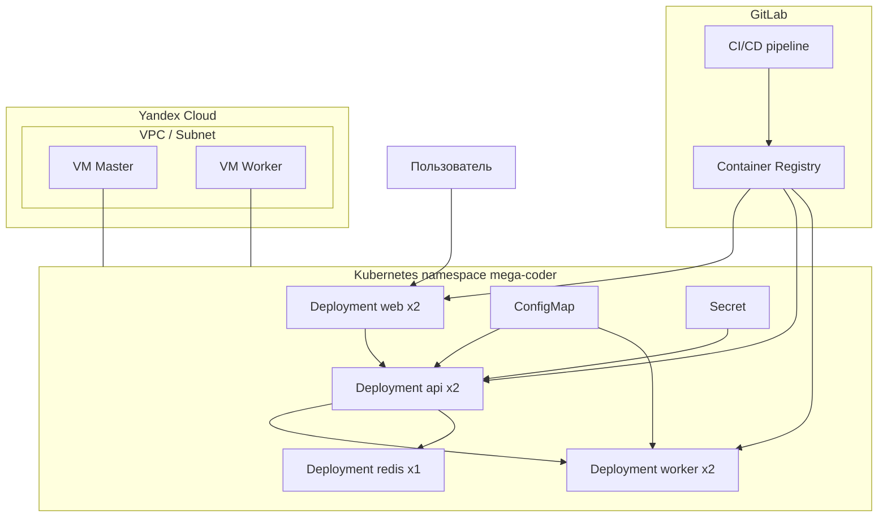
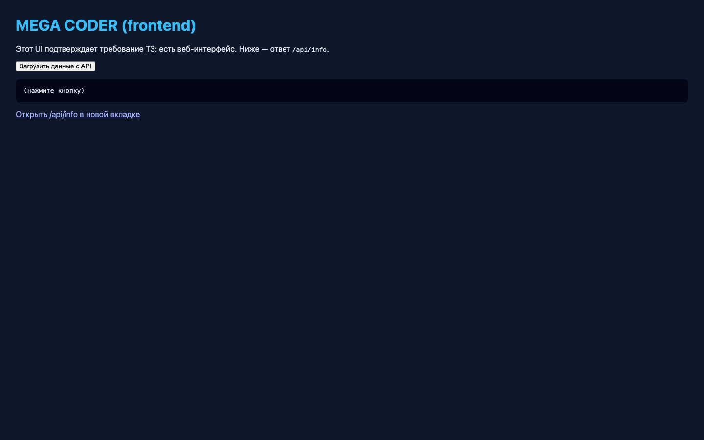
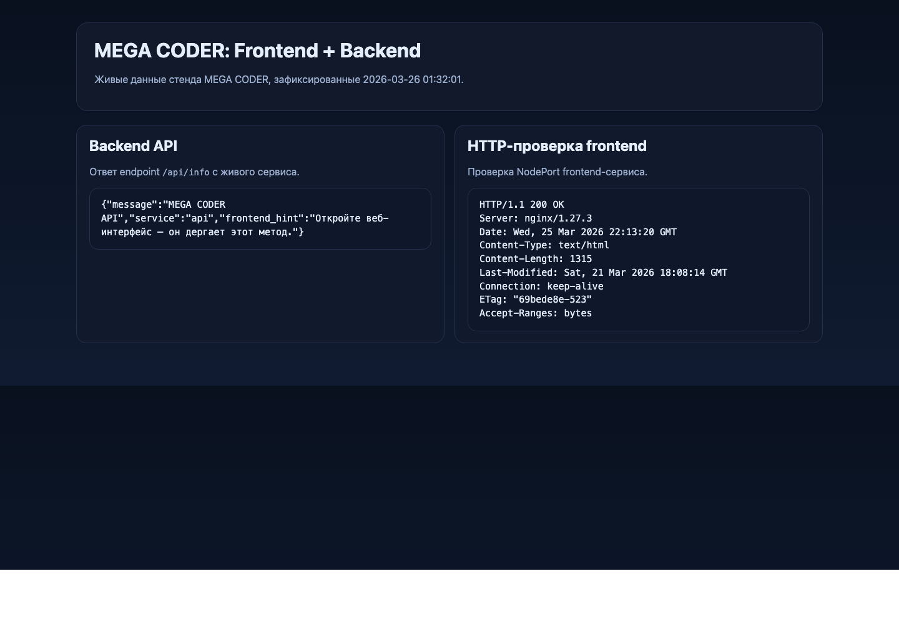
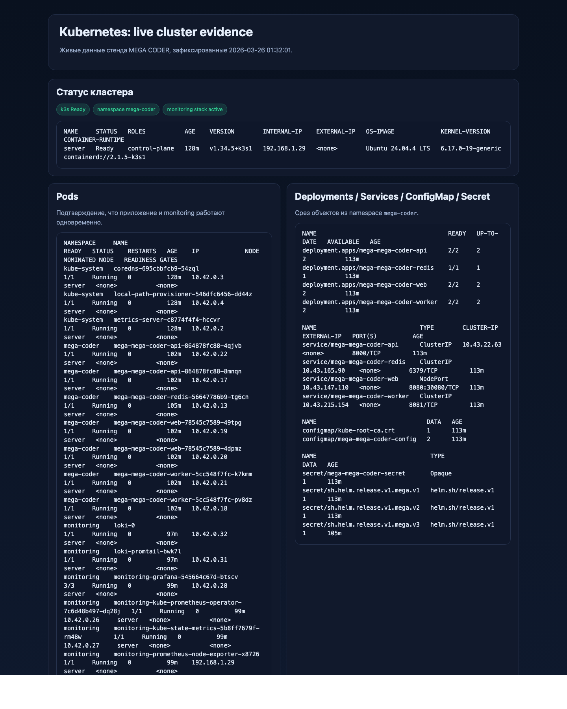
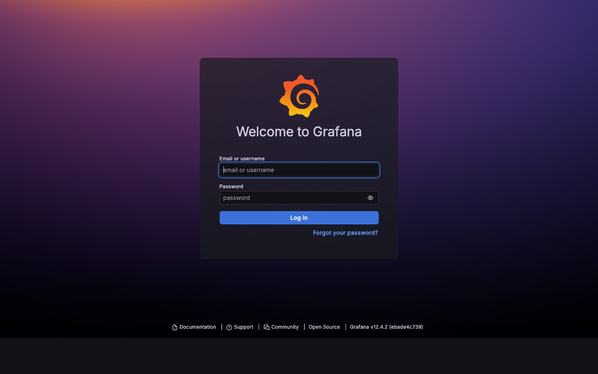
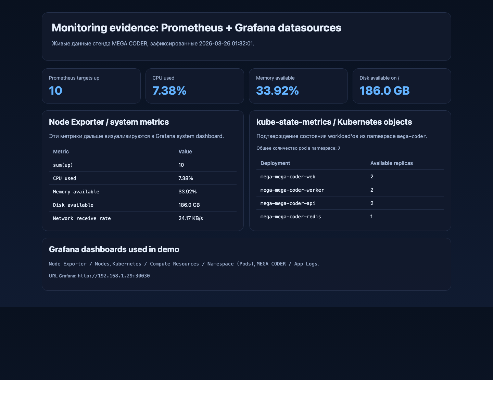
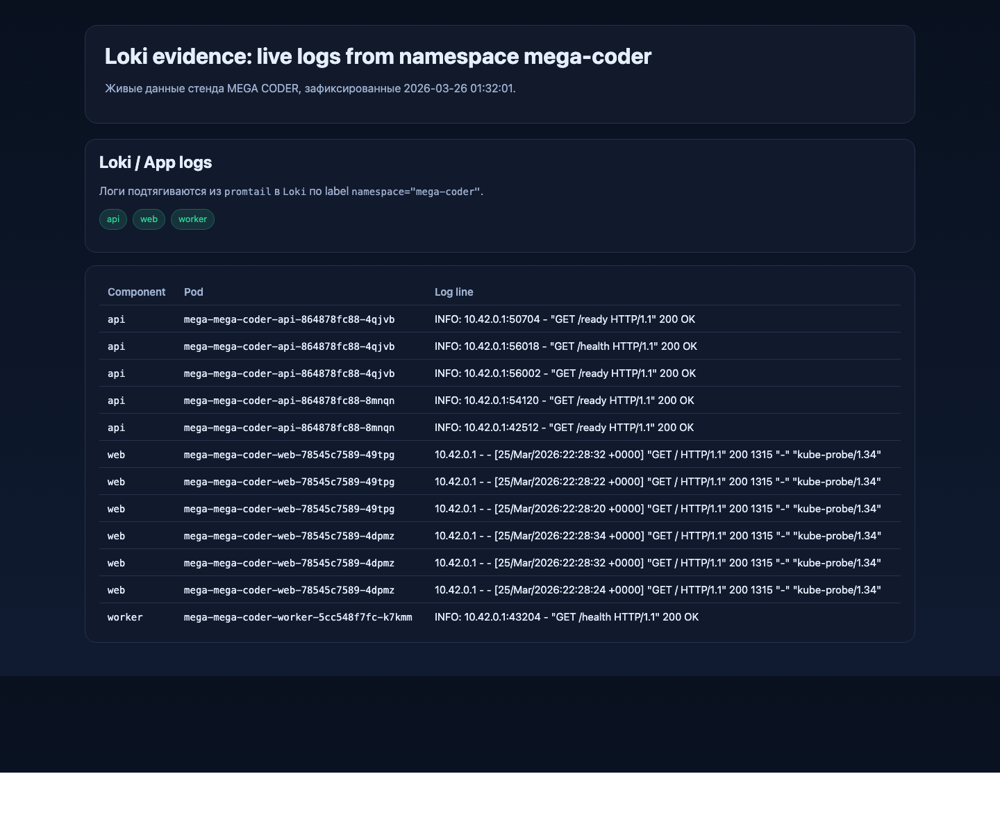

# Отчёт по курсу DevOps — проект «MEGA CODER»

**Выполнил:** Сергей  
**GitHub:** `https://github.com/SERGEY-MEGA/DEVOPS_Mega-Coder`  
**Self-hosted GitLab:** `http://192.168.1.29:8080/MEGA/deveps-mega-coder`

---

## 0. Где что лежит

| Документ | Назначение |
|----------|------------|
| `README.md` | Краткое описание проекта и быстрые команды. |
| `REPORT.md` | Полный отчёт по ТЗ курса. |
| `PROJECT_MAP.md` | Подробная карта репозитория: где лежит код и инфраструктура. |
| `DEFENSE_GUIDE.md` | Шпаргалка для устной защиты. |


---

## 1. Описание приложения и архитектуры

### 1.1 Назначение проекта

`MEGA CODER` — учебный DevOps-стенд, который показывает полный цикл работы с приложением:

- исходный код;
- Docker-образы;
- GitLab CI/CD;
- деплой в Kubernetes через Helm;
- инфраструктура через Terraform;
- харднинг серверов через Ansible;
- мониторинг через Prometheus, Grafana, Loki, Promtail, Node Exporter и kube-state-metrics.

### 1.2 Состав сервисов

По ТЗ приложение должно содержать минимум 3 сервиса. В проекте используются:

| Сервис | Назначение | Технология | Проверка |
|--------|------------|------------|----------|
| `web` | UI и reverse proxy к backend | Nginx + HTML | `/` |
| `api` | Основной backend REST API | FastAPI | `/health`, `/ready`, `/api/info` |
| `worker` | Вспомогательный микросервис | FastAPI | `/health`, `/work/ping` |
| `redis` | Инфраструктурный сервис для backend | Redis | `redis-cli ping` |

### 1.3 Архитектурная схема



### 1.4 Где находится код

Ключевые папки проекта:

| Папка | Назначение |
|-------|------------|
| `api/` | Backend-сервис на FastAPI |
| `web/` | Frontend и Nginx reverse proxy |
| `worker/` | Вспомогательный микросервис |
| `helm/mega-coder/` | Helm chart приложения |
| `terraform/` | Инфраструктура в Yandex Cloud |
| `ansible/` | Автоматизация hardening |
| `monitoring/` | Установка мониторинга |

Подробная расшифровка всех файлов вынесена в `PROJECT_MAP.md`.

---

## 2. Как запустить проект

### 2.1 Предусловия

Нужно иметь:

- GitLab project с включённым Container Registry;
- Kubernetes-кластер из 1 master + 1 worker;
- `terraform >= 1.3`;
- `ansible`;
- `kubectl`;
- `helm`;
- `docker` для локальной сборки и проверки.

### 2.2 Terraform

1. Скопировать `terraform/terraform.tfvars.example` в `terraform/terraform.tfvars`.
2. Заполнить `cloud_id`, `folder_id`, `allow_ssh_cidr`, `ssh_public_key_path`.
3. Выполнить:

```bash
cd terraform
terraform init
terraform plan
terraform apply
```

После этого Terraform создаёт:

- VPC;
- subnet;
- security group;
- VM master;
- VM worker.

### 2.3 Ansible

1. Установить коллекции:

```bash
cd ansible
ansible-galaxy collection install -r requirements.yml
```

2. Создать `ansible/inventory/hosts.ini` на основе `inventory/hosts.ini.example`.
3. Подставить IP-адреса из `terraform output`.
4. Выполнить:

```bash
ansible-playbook -i inventory/hosts.ini site.yml
```

Роль делает:

- обновление пакетов;
- отключение `PermitRootLogin`;
- отключение `PasswordAuthentication`;
- настройку `UFW`;
- установку `auditd`;
- применение `sysctl`.

### 2.4 Локальная проверка Docker-образов

```bash
docker build -t mega-api:local ./api
docker build -t mega-worker:local ./worker
docker build -t mega-web:local ./web
```

### 2.5 Деплой Helm

Пример ручного деплоя:

```bash
export REG=registry.gitlab.com/<group>/<project>
export TAG=dev-local

helm upgrade --install mega ./helm/mega-coder -n mega-coder --create-namespace \
  --set global.imageRegistry="$REG" \
  --set images.api.tag="$TAG" \
  --set images.web.tag="$TAG" \
  --set images.worker.tag="$TAG" \
  --set-json 'imagePullSecrets=[{"name":"gitlab-registry"}]' \
  --set secrets.appSharedSecret="local-demo"
```

Проверка:

```bash
kubectl get pods -n mega-coder
kubectl get svc -n mega-coder
kubectl port-forward -n mega-coder svc/mega-mega-coder-web 8080:8080
```

После port-forward приложение доступно по `http://127.0.0.1:8080`.

### 2.6 Локальный live-стенд для защиты

Для демонстрации на домашнем сервере поднят живой стенд:

- `k3s` single-node на `192.168.1.29`;
- приложение доступно по `http://192.168.1.29:30080`;
- Grafana доступна по `http://192.168.1.29:30030`;
- GitLab проекта доступен по `http://192.168.1.29:8080/MEGA/deveps-mega-coder`.

Именно этот стенд использовался для снятия скриншотов ниже.

---

## 3. Переменные окружения

### 3.1 Backend `api`

| Переменная | Назначение |
|------------|------------|
| `SERVICE_NAME` | Имя сервиса в ответах API |
| `REDIS_URL` | URL подключения к Redis |
| `WORKER_BASE_URL` | URL worker-сервиса |
| `APP_SHARED_SECRET` | Пример секрета приложения |

### 3.2 Worker

| Переменная | Назначение |
|------------|------------|
| `SERVICE_NAME` | Имя worker-сервиса |

### 3.3 Web

| Переменная | Назначение |
|------------|------------|
| `PORT` | Порт Nginx |
| `API_UPSTREAM` | Куда проксировать `/api/` |

### 3.4 GitLab CI Variables

| Имя | Тип | Назначение |
|-----|-----|------------|
| `KUBE_CONFIG` | File | kubeconfig для deploy job |
| `APP_SHARED_SECRET` | Masked variable | Секрет приложения |

Также используются встроенные переменные GitLab:

- `CI_REGISTRY`
- `CI_REGISTRY_IMAGE`
- `CI_REGISTRY_USER`
- `CI_REGISTRY_PASSWORD`
- `CI_JOB_TOKEN`

---

## 4. CI/CD pipeline

Pipeline описан в файле `.gitlab-ci.yml`.

### 4.1 Stages

Используются обязательные стадии:

- `pre_build`
- `build`
- `deploy`

### 4.2 `pre_build`

Job `prepare_image_tag`:

- формирует `IMAGE_TAG=${CI_COMMIT_SHORT_SHA}-${CI_PIPELINE_ID}`;
- формирует `REGISTRY_BASE=${CI_REGISTRY_IMAGE}`;
- передаёт значения дальше через `artifacts:reports:dotenv`.

Это соответствует ТЗ: подготовка артефактов перед сборкой.

### 4.3 `build`

Job-ы:

- `build_api`
- `build_web`
- `build_worker`

Что происходит:

- используется Kaniko вместо `docker:dind`;
- выполняется сборка Docker-образов;
- образы пушатся в GitLab Container Registry;
- включён `Kaniko cache` для ускорения повторных сборок.

### 4.4 `deploy`

Job `deploy_helm`:

- работает только на ветке `main`;
- использует `KUBE_CONFIG`;
- создаёт namespace;
- создаёт `docker-registry` secret;
- выполняет `helm upgrade --install`.

Дополнительно включены полезные бонусы:

- `--atomic` — автоматический rollback при неудачном релизе;
- `--cleanup-on-fail` — очистка неуспешного релиза.

### 4.5 Поведение по веткам

Реализовано разделение сценариев:

- merge request / branch pipeline — `pre_build` + `build`;
- `main` pipeline — `pre_build` + `build` + `deploy`.

---

## 5. Docker

ТЗ по Docker закрывается так:

| Требование | Где реализовано |
|------------|-----------------|
| Multi-stage build | `api/Dockerfile`, `worker/Dockerfile`, `web/Dockerfile` |
| Минимальный runtime-образ | Alpine/slim образы |
| Запуск не от root | `USER app`, `su-exec nginx` |
| `.dockerignore` | `api/.dockerignore`, `web/.dockerignore`, `worker/.dockerignore` |
| HEALTHCHECK | Во всех трёх Dockerfile |
| Фиксация версий базовых образов | Используются фиксированные теги, не `latest` |

---

## 6. Kubernetes и Helm

### 6.1 Обязательные объекты

| Объект | Где реализован |
|--------|----------------|
| Namespace | `helm/mega-coder/templates/namespace.yaml` |
| Deployment | `deployment-api.yaml`, `deployment-web.yaml`, `deployment-worker.yaml`, `deployment-redis.yaml` |
| Service | `service-api.yaml`, `service-web.yaml`, `service-worker.yaml`, `service-redis.yaml` |
| ConfigMap | `configmap.yaml` |
| Secret | `secret.yaml` |

### 6.2 Реплики

В `values.yaml` заданы:

- `api: 2`
- `web: 2`
- `worker: 2`
- `redis: 1`

Это покрывает требование по минимум двум репликам приложения.

### 6.3 Параметризация

Все изменяемые параметры вынесены в `helm/mega-coder/values.yaml`:

- image registry;
- tags;
- replicaCount;
- ports;
- ingress;
- app secret.

---

## 7. Terraform

ТЗ по Terraform закрывается следующим образом:

| Требование | Реализация |
|------------|------------|
| Terraform `>= 1.3` | `terraform/versions.tf` |
| 2 ВМ | `yandex_compute_instance.master`, `yandex_compute_instance.worker` |
| VPC + Subnet | `yandex_vpc_network`, `yandex_vpc_subnet` |
| Security Group | `yandex_vpc_security_group` |
| SSH key | `metadata.ssh-keys` |
| variables.tf | `terraform/variables.tf` |
| outputs.tf | `terraform/outputs.tf` |

Открытые порты:

- `22` — SSH
- `6443` — Kubernetes API
- `80` / `443` — HTTP/HTTPS
- `30000-32767` — NodePort

---

## 8. Ansible

Выбран **вариант A — hardening**.

### 8.1 Что делает роль

`ansible/roles/hardening/tasks/main.yml`:

- обновляет пакеты;
- устанавливает `ufw`, `auditd`, `audispd-plugins`;
- отключает root-login;
- запрещает парольную аутентификацию;
- включает UFW;
- открывает только нужные порты;
- включает `auditd`;
- применяет `sysctl`.

### 8.2 Идемпотентность

Используются стандартные модули Ansible:

- `apt`
- `lineinfile`
- `service`
- `wait_for`
- `sysctl`
- `community.general.ufw`

Повторный запуск не должен ломать систему.

---

## 9. Monitoring

Используется обязательный стек:

- Prometheus
- Grafana
- Node Exporter
- Loki
- Promtail
- kube-state-metrics

Файлы:

| Путь | Назначение |
|------|------------|
| `monitoring/README.md` | Команды установки и базовые шаги |
| `monitoring/values-kube-prometheus.yaml` | Prometheus, Grafana, Node Exporter, kube-state-metrics |
| `monitoring/values-loki-stack.yaml` | Loki и Promtail |

### 9.1 Дашборды по ТЗ

Нужно показать:

1. Системный дашборд: CPU, RAM, Disk, Network.
2. Kubernetes dashboard: pod/deployment/replica state.
3. Логи приложения: Loki Explore или dashboard по namespace `mega-coder`.

### 9.2 Что приложить к отчёту

В PDF-версию отчёта или отдельной папкой стоит приложить:

1. Скриншот Grafana system dashboard.
2. Скриншот Kubernetes dashboard.
3. Скриншот Loki Explore с логами приложения.

---

## 10. Где показывать код на защите

| Что хотят увидеть | Какой файл открыть |
|-------------------|--------------------|
| Backend-код | `api/app/main.py` |
| UI и frontend | `web/html/index.html` |
| Reverse proxy | `web/nginx.conf` |
| Worker-сервис | `worker/app/main.py` |
| Docker | `api/Dockerfile`, `worker/Dockerfile`, `web/Dockerfile` |
| CI/CD | `.gitlab-ci.yml` |
| Helm | `helm/mega-coder/values.yaml` и `templates/` |
| Terraform | `terraform/main.tf` |
| Ansible | `ansible/roles/hardening/tasks/main.yml` |
| Monitoring | `monitoring/README.md` |

---

## 11. Соответствие чек-листу ТЗ

| Требование | Где реализовано |
|------------|-----------------|
| 3+ сервиса | `api/`, `web/`, `worker/` |
| HTTP endpoint или UI | `web/html/index.html`, `api/app/main.py`, `worker/app/main.py` |
| Параметризация через env | `api/app/main.py`, `worker/app/main.py`, `web/docker-entrypoint.sh`, Helm env |
| GitLab CI/CD | `.gitlab-ci.yml` |
| stages pre_build/build/deploy | `.gitlab-ci.yml` |
| Секреты через Variables | `KUBE_CONFIG`, `APP_SHARED_SECRET` |
| Docker multi-stage | Dockerfile всех сервисов |
| Non-root | Dockerfile и entrypoint |
| `.dockerignore` | во всех сервисах |
| Namespace / Deployment / Service / ConfigMap / Secret | `helm/mega-coder/templates/` |
| Helm chart | `helm/mega-coder/` |
| Terraform ≥ 1.3 | `terraform/versions.tf` |
| 2 ВМ | `terraform/main.tf` |
| VPC + subnet + firewall + SSH key | `terraform/main.tf` |
| Ansible inventory + role + site.yml | `ansible/` |
| Вариант A hardening | `ansible/roles/hardening/` |
| Prometheus / Grafana / Loki / Promtail / Node Exporter / kube-state-metrics | `monitoring/` |

---

## 12. Итог

В проекте реализован полный учебный DevOps-пайплайн:

- написано многосервисное приложение;
- сервисы контейнеризированы;
- настроен GitLab CI/CD;
- описан деплой в Kubernetes через Helm;
- инфраструктура описана в Terraform;
- базовая защита серверов автоматизирована через Ansible;
- подготовлен мониторинг;
- подготовлен отчёт и документы для защиты.

Для устного рассказа по репозиторию используется `DEFENSE_GUIDE.md`, а для навигации по коду — `PROJECT_MAP.md`.

---

## 13. Скриншоты рабочего стенда

Ниже зафиксированы скриншоты с реально работающего демо-стенда. Для backend, Kubernetes, Prometheus и Loki использованы живые данные, полученные непосредственно с сервера `192.168.1.29` на момент подготовки отчёта.

### 13.1 Frontend

Фронтенд-сервис доступен по NodePort и подтверждает выполнение требования ТЗ про UI-интерфейс.



### 13.2 Backend API

Backend отвечает на endpoint `/api/info`, а frontend успешно отдает HTTP `200 OK`.



### 13.3 Kubernetes / k3s

На скриншоте ниже видны:

- нода кластера `k3s` в статусе `Ready`;
- pod'ы приложения и monitoring;
- объекты `Deployment`, `Service`, `ConfigMap`, `Secret`;
- Helm releases для приложения и monitoring stack.



### 13.4 Grafana UI

Grafana web UI поднята и доступна на локальном сервере.



### 13.5 Monitoring stack

Ниже показаны живые метрики из Prometheus и kube-state-metrics, которые используются в Grafana dashboard'ах:

- количество доступных scrape-target;
- загрузка CPU;
- доступная память;
- свободное место на диске;
- доступные реплики deployment'ов в namespace `mega-coder`.



### 13.6 Loki / application logs

Ниже показаны реальные логи, собранные `Promtail` и доступные через `Loki` по namespace `mega-coder`. В выборке присутствуют логи `api`, `web` и `worker`.



### 13.7 Исходные evidence-файлы

Дополнительно в репозитории сохранены исходные данные, из которых были собраны страницы доказательств:

- `report-assets/evidence/k8s-live.txt`
- `report-assets/evidence/api-info.json`
- `report-assets/evidence/prometheus-*.json`
- `report-assets/evidence/loki-query.json`
- `report-assets/html/*.html`
