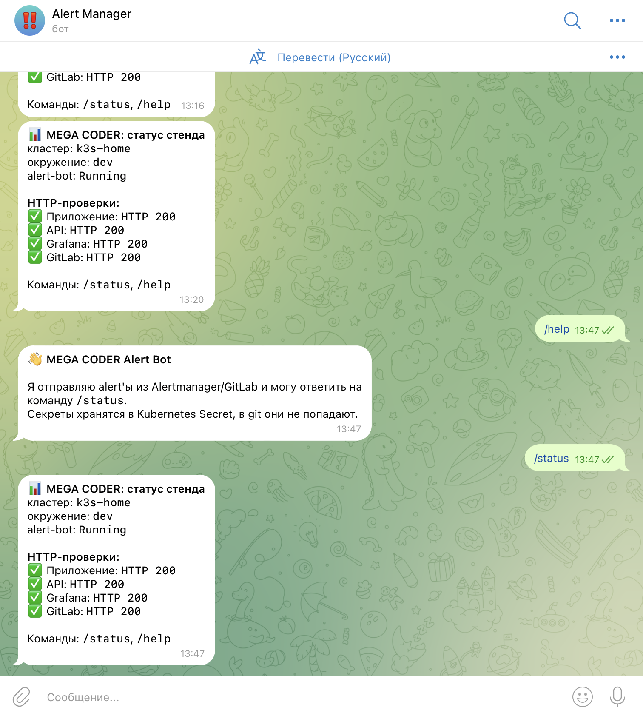

# Отчёт: Alertmanager и Telegram-бот для уведомлений

## 1. Цель работы

Цель работы — настроить отправку уведомлений о событиях мониторинга из Alertmanager в Telegram. Для этого в Kubernetes был добавлен отдельный сервис `alert-bot`, который принимает webhook-сообщения от Alertmanager, форматирует их на русском языке и отправляет в Telegram-чат через Telegram Bot API.

В отчёте не указаны реальные токены, пароли, `chat_id`, kubeconfig и другие конфиденциальные данные. Все секреты хранятся только в Kubernetes Secret или переменных окружения.

## 2. Общая схема решения

```text
PrometheusRule
    -> Prometheus
    -> Alertmanager
    -> webhook /webhook/alertmanager
    -> alert-bot в Kubernetes
    -> Telegram Bot API
    -> Telegram-чат с уведомлениями
```

Компоненты:

| Компонент | Назначение |
|---|---|
| Prometheus | Собирает метрики и вычисляет alert rules |
| Alertmanager | Принимает alerts от Prometheus, группирует их и отправляет webhook |
| alert-bot | Webhook-сервис, который преобразует alert в понятное Telegram-сообщение |
| Telegram Bot API | Внешний API Telegram для отправки сообщений |
| Kubernetes Secret | Безопасное хранение token, chat_id и webhook secret |

## 3. Создание Telegram-бота

Бот создавался через стандартного Telegram-бота `@BotFather`.

Порядок действий:

1. В Telegram был открыт `@BotFather`.
2. Выполнена команда `/newbot`.
3. Задано имя бота, например `Alert Manager`.
4. Задан username бота, который заканчивается на `bot`.
5. BotFather выдал токен Telegram Bot API.
6. Токен не был записан в код, README, отчёты или скриншоты.
7. Токен был использован только при создании Kubernetes Secret.

Пример токена в документации:

```text
<telegram-bot-token>
```

Реальное значение в репозитории не хранится.

## 4. Получение chat_id

Чтобы бот знал, куда отправлять сообщения, был получен `chat_id`.

Порядок действий:

1. Пользователь написал созданному Telegram-боту сообщение `/start`.
2. После этого локально был выполнен запрос к Telegram API `getUpdates`.
3. Из JSON-ответа был взят `message.chat.id`.
4. Полученный `chat_id` был сохранён в Kubernetes Secret.

Пример команды без реального токена:

```bash
export TELEGRAM_BOT_TOKEN="<telegram-bot-token>"
curl -s "https://api.telegram.org/bot${TELEGRAM_BOT_TOKEN}/getUpdates"
```

В репозитории не хранится ни токен, ни `chat_id`.

## 5. Создание Kubernetes Secret

Для хранения секретов был создан Kubernetes Secret `mega-coder-alerting-secret` в namespace `mega-coder`.

В Secret были сохранены следующие значения:

| Ключ | Назначение |
|---|---|
| `TELEGRAM_BOT_TOKEN` | Токен Telegram-бота |
| `TELEGRAM_CHAT_ID` | ID чата, куда отправляются уведомления |
| `TELEGRAM_PARSE_MODE` | Режим форматирования сообщений, используется `HTML` |
| `ALERTMANAGER_WEBHOOK_SECRET` | Секрет для проверки webhook-запросов от Alertmanager |

Пример команды без конфиденциальных данных:

```bash
sudo k3s kubectl create secret generic mega-coder-alerting-secret \
  -n mega-coder \
  --from-literal=TELEGRAM_BOT_TOKEN="<telegram-bot-token>" \
  --from-literal=TELEGRAM_CHAT_ID="<telegram-chat-id>" \
  --from-literal=TELEGRAM_PARSE_MODE="HTML" \
  --from-literal=ALERTMANAGER_WEBHOOK_SECRET="<alertmanager-webhook-secret>" \
  --dry-run=client -o yaml | sudo k3s kubectl apply -f -
```

Такой подход позволяет менять токен и другие секреты без изменения кода приложения и без коммита секретов в git.

## 6. Сервис alert-bot

Для приёма webhook-сообщений был добавлен сервис `alert-bot`.

Основной код находится в:

```text
services/alert-bot/app/main.py
```

Сервис реализован как FastAPI-приложение и имеет endpoint:

```text
POST /webhook/alertmanager
```

Что делает `alert-bot`:

- принимает JSON payload от Alertmanager;
- проверяет webhook secret, если он задан;
- разбирает список alerts;
- определяет статус `firing` или `resolved`;
- определяет severity: `critical`, `warning`, `info`;
- берёт из labels и annotations данные об alert;
- форматирует сообщение на русском языке;
- экранирует HTML-символы для безопасного Telegram HTML parse mode;
- отправляет сообщение в Telegram через Bot API;
- использует retry и timeout, чтобы временные сетевые ошибки не ломали отправку.

В сообщении отображаются:

- имя alert;
- статус;
- severity;
- namespace;
- pod, deployment, service или instance;
- summary;
- description;
- время начала;
- runbook URL, если он задан.

## 7. Helm-настройка

Alerting-компоненты встроены в Helm chart приложения, но по умолчанию выключены, чтобы не менять рабочий деплой без явного включения.

Базовая настройка:

```yaml
alerting:
  enabled: false
```

Для демонстрационного стенда используется отдельный overlay:

```text
examples/values-alerting-enable.yaml
```

В overlay включаются:

```yaml
alerting:
  enabled: true
  secrets:
    existingSecret: mega-coder-alerting-secret
  alertBot:
    hostNetwork: true
    enableCommands: true
```

`existingSecret` означает, что Helm chart не создаёт секрет с реальными значениями, а использует уже созданный Kubernetes Secret.

На домашнем стенде был включён `hostNetwork: true`, потому что доступ к Telegram API с хоста работал стабильнее, чем из обычной pod-сети. Это сделано только в overlay-файле для стенда, а не в базовом `values.yaml`.

Команда применения:

```bash
sudo env KUBECONFIG=/etc/rancher/k3s/k3s.yaml helm upgrade --install mega ./helm/mega-coder \
  -n mega-coder \
  --reuse-values \
  -f examples/values-alerting-enable.yaml
```

Флаг `--reuse-values` нужен, чтобы повторные деплои приложения не удаляли ранее включённый alerting overlay.

## 8. Настройка Alertmanager

Alertmanager настраивается на отправку webhook в сервис `alert-bot`.

Пример конфигурации без секретов:

```yaml
route:
  group_by: ["alertname", "namespace", "severity"]
  group_wait: 20s
  group_interval: 2m
  repeat_interval: 2h
  receiver: "telegram-alert-bot"

receivers:
  - name: "telegram-alert-bot"
    webhook_configs:
      - url: "http://mega-mega-coder-alert-bot.mega-coder.svc.cluster.local:8088/webhook/alertmanager"
        send_resolved: true
```

Файл-пример в проекте:

```text
monitoring/alertmanager/alertmanager.yml
```

`send_resolved: true` нужен, чтобы Telegram получал не только сообщение о проблеме, но и сообщение о восстановлении.

## 9. Prometheus alert rules

Для формирования alerts используются правила Prometheus.

Примеры правил:

| Alert | Назначение |
|---|---|
| `PodCrashLooping` | Pod постоянно перезапускается |
| `PodRestartTooOften` | Слишком много рестартов |
| `DeploymentReplicasMismatch` | Количество доступных реплик меньше ожидаемого |
| `PodNotReady` | Pod долго не готов |
| `HighCPUUsage` | Высокая CPU-нагрузка |
| `HighMemoryUsage` | Высокое потребление памяти |
| `TargetDown` | Prometheus target недоступен |

Файлы с правилами:

```text
monitoring/prometheus/rules/mega-coder-alerts.yaml
helm/mega-coder/templates/prometheusrule-alerts.yaml
```

Каждый alert содержит labels и annotations, которые затем используются в Telegram-сообщении.

## 10. Проверка работы

Проверка pod в Kubernetes:

```bash
sudo k3s kubectl get deploy,pod,svc -n mega-coder | grep alert-bot
```

Проверка логов:

```bash
sudo k3s kubectl logs -n mega-coder deploy/mega-mega-coder-alert-bot --tail=50
```

Ожидаемые признаки:

```text
Application startup complete.
Telegram command polling enabled.
Telegram notification sent.
```

Проверка через тестовый payload:

```bash
python3 scripts/smoke_alert_bot.py \
  --url http://127.0.0.1:8088/webhook/alertmanager \
  --payload examples/alertmanager-firing.json \
  --secret "<alertmanager-webhook-secret>"
```

После успешной проверки в Telegram приходит сообщение с alert.

## 11. Интерактивные команды бота

Дополнительно для удобной проверки был включён режим Telegram-команд.

Команды:

```text
/help
/status
```

`/help` кратко объясняет, для чего нужен бот.

`/status` делает лёгкую проверку стенда и показывает HTTP-статусы:

- приложение;
- API;
- Grafana;
- GitLab.

Эта функция включается флагом:

```yaml
alerting:
  alertBot:
    enableCommands: true
```

Бот отвечает только в разрешённый `TELEGRAM_CHAT_ID`.

## 12. Скриншоты результата

### 12.1 Alertmanager: срабатывание alert


### 12.2 Alertmanager: восстановление alert и сводка


### 12.3 Интерактивные команды `/help` и `/status`



## 13. Итог

В результате настроена рабочая цепочка уведомлений:

```text
Prometheus -> Alertmanager -> alert-bot -> Telegram
```

Секреты не хранятся в репозитории. Токен Telegram-бота, `chat_id` и webhook secret вынесены в Kubernetes Secret. Сервис `alert-bot` работает в Kubernetes, принимает alerts от Alertmanager, форматирует сообщения на русском языке и отправляет их в Telegram. Дополнительно реализована команда `/status`, с помощью которой можно быстро проверить состояние стенда прямо из Telegram.
