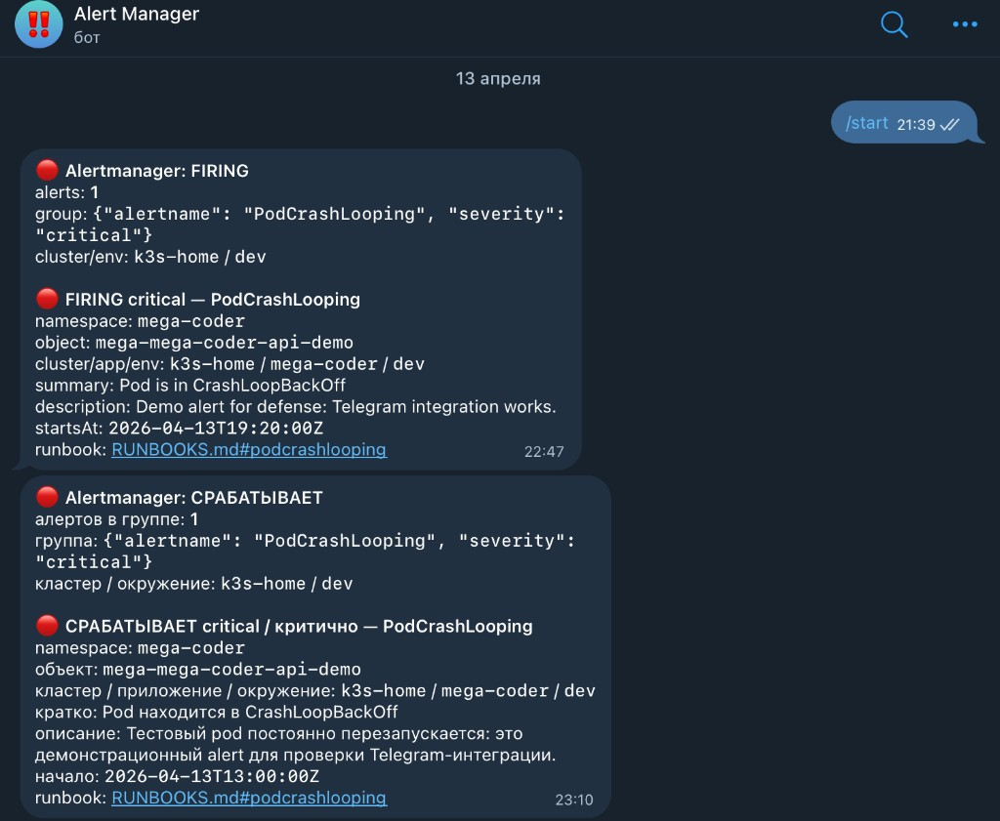
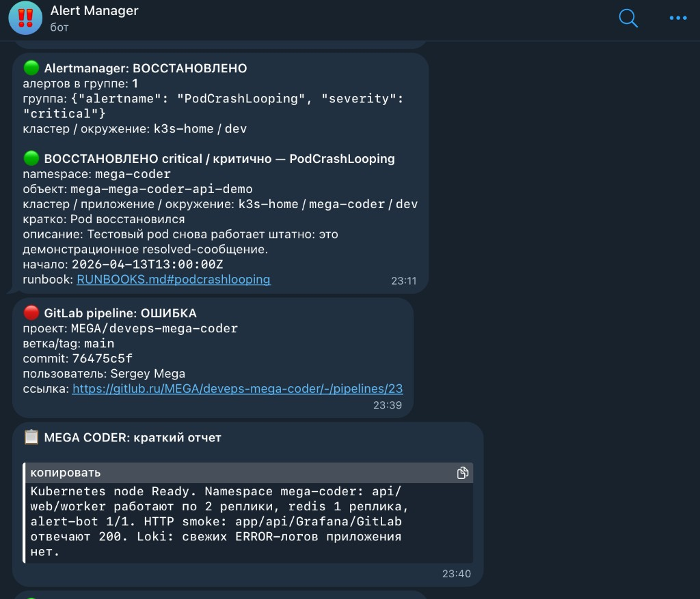
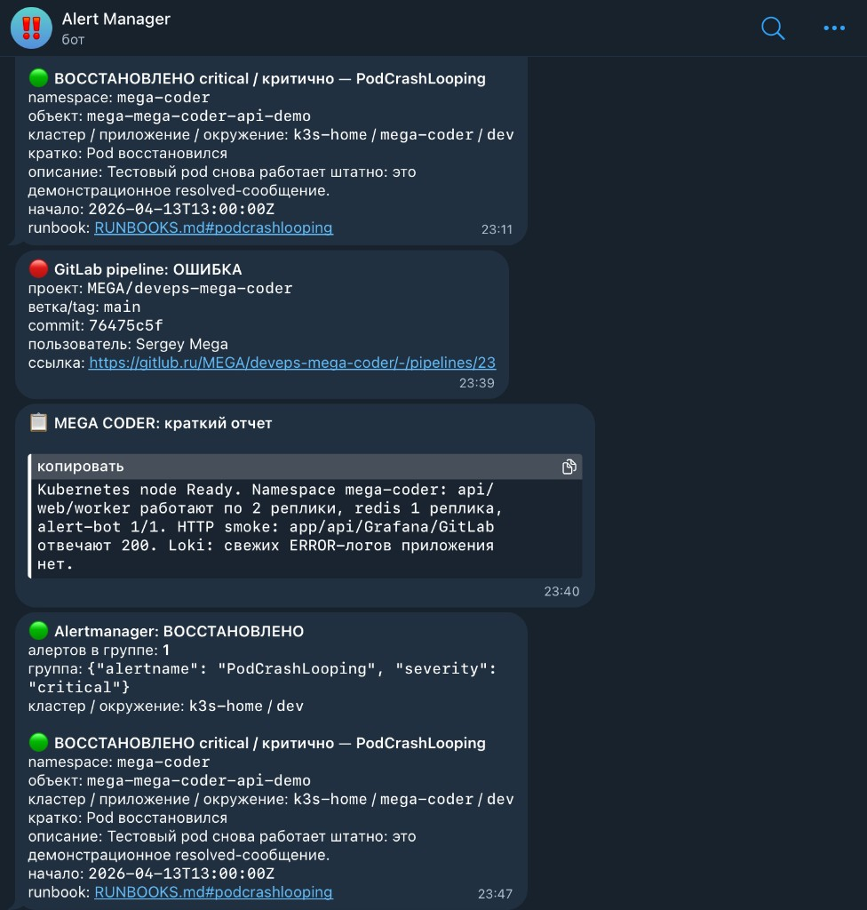

# Alert Manager → Telegram: настройка и живые скриншоты

Папка в **корне репозитория** — чтобы преподавателю было сразу видно: как подключён бот, что приходит в Telegram, и **реальные кадры** с чата (не заглушки).

**Связанные материалы:** [BOT_SETUP.md](../BOT_SETUP.md) · [DEMO_ALERTS.md](../DEMO_ALERTS.md) · [docs/alert-manager/TELEGRAM_ALERTING_FULL_REPORT.md](../docs/alert-manager/TELEGRAM_ALERTING_FULL_REPORT.md) · код моста: [`services/alert-bot/`](../services/alert-bot/)

---

## 1. Что на скриншотах

| Файл | Что показано |
|------|----------------|
| [telegram-01-firing-en-and-ru.png](./telegram-01-firing-en-and-ru.png) | Чат с ботом **Alert Manager**: команда `/start`, затем алерт **Alertmanager: FIRING** (англ.) и **СРАБАТЫВАЕТ** (рус.) для `PodCrashLooping`, namespace `mega-coder`, pod `mega-mega-coder-api-demo`, кластер `k3s-home`, ссылка на runbook. |
| [telegram-02-resolved-gitlab-report.png](./telegram-02-resolved-gitlab-report.png) | **ВОССТАНОВЛЕНО** (resolved), уведомление **GitLab pipeline: ОШИБКА** по проекту на **gitlub.ru**, краткий отчёт **MEGA CODER** (реплики, HTTP 200, Loki без ERROR). |
| [telegram-03-chat-full-thread.png](./telegram-03-chat-full-thread.png) | Тот же сценарий подробнее: resolved, GitLab, отчёт, групповое **Alertmanager: ВОССТАНОВЛЕНО** с метаданными группы. |

---

## 2. Как создал и подключил бота (пошагово)

### 2.1 Telegram: бот у BotFather

1. В Telegram открыл [@BotFather](https://t.me/BotFather), команда `/newbot`.
2. Задал имя бота (как в интерфейсе — **Alert Manager**) и username, оканчивающийся на `bot`.
3. Сохранил **токен** только локально / в Secret (в git и в отчёт токен **не** вставлял).
4. Написал боту `/start` в личку, чтобы можно было получить **chat_id** через `getUpdates` (см. [BOT_SETUP.md](../BOT_SETUP.md)).

### 2.2 Секреты в Kubernetes

Создал Secret `mega-coder-alerting-secret` в namespace `mega-coder` с полями:

- `TELEGRAM_BOT_TOKEN` — токен от BotFather  
- `TELEGRAM_CHAT_ID` — id чата, куда слать уведомления  
- `TELEGRAM_PARSE_MODE` — `HTML` (как в коде `alert-bot`)  
- `ALERTMANAGER_WEBHOOK_SECRET` — общий секрет для заголовка `X-Webhook-Secret` на `/webhook/alertmanager`, `/webhook/grafana`, `/webhook/report`  
- `GITLAB_WEBHOOK_SECRET` — секрет для заголовка `X-Gitlab-Token` на `/webhook/gitlab`  

Готовые команды `kubectl` / `k3s kubectl`: [BOT_SETUP.md](../BOT_SETUP.md).

### 2.3 Запуск моста в кластере (alert-bot)

1. В Helm alerting по умолчанию выключен; включил overlay:

   `helm upgrade --install mega ./helm/mega-coder -n mega-coder -f helm/mega-coder/values.yaml -f examples/values-alerting-enable.yaml`

2. В overlay для домашнего k3s указан **`hostNetwork: true`** у `alert-bot`, чтобы исходящие запросы к `api.telegram.org` шли через сеть хоста (из pod-сети Telegram был недоступен).

3. Под `...-alert-bot` читает Secret и поднимает FastAPI на порту **8088** (`/health`, webhooks).

### 2.4 Подключение Alertmanager

В конфигурации Alertmanager настроен **receiver** с типом webhook на внутренний URL сервиса, например:

`http://<release>-alert-bot.mega-coder.svc.cluster.local:8088/webhook/alertmanager`

В заголовке запроса передаётся `X-Webhook-Secret` = `ALERTMANAGER_WEBHOOK_SECRET`. Пример YAML без секретов: [monitoring/alertmanager/alertmanager.yml](../monitoring/alertmanager/alertmanager.yml).

Правила Prometheus (`PodCrashLooping` и др.): [monitoring/prometheus/rules/mega-coder-alerts.yaml](../monitoring/prometheus/rules/mega-coder-alerts.yaml).

### 2.5 Подключение GitLab (gitlub.ru)

1. В проекте на **gitlub.ru** (не gitlab.com): **Settings → Webhooks**.  
2. URL: доступный с сервера GitLab адрес до `.../webhook/gitlab` (часто через Ingress или внутренний URL к сервису `alert-bot`).  
3. **Secret token** = значение `GITLAB_WEBHOOK_SECRET`.  
4. Включены события: Push, Pipeline, Merge request, Tag и т.п. по необходимости.  

После этого при падении pipeline в Telegram приходит сообщение вида **GitLab pipeline: ОШИБКА** со ссылкой на pipeline на gitlub.ru (как на скриншотах).

### 2.6 Краткий отчёт (reporter)

Сервис **reporter** собирает состояние namespace, smoke HTTP, выборку из Loki и при включённой опции шлёт сводку в тот же бот через `POST /webhook/report` (см. Helm `cronjob-reporter`, [services/reporter/](../services/reporter/)). На скриншотах виден блок **MEGA CODER: краткий отчет** с репликами и проверками.

### 2.7 Как повторить проверку без реального инцидента

Локально через port-forward на сервис `alert-bot` и скрипт:

```bash
python3 scripts/smoke_alert_bot.py \
  --url http://127.0.0.1:8088/webhook/alertmanager \
  --payload examples/alertmanager-firing.json \
  --secret "$ALERTMANAGER_WEBHOOK_SECRET"
```

Подробнее: [DEMO_ALERTS.md](../DEMO_ALERTS.md).

---

## 3. Скриншоты (как в защите)

### 3.1 Firing: английский и русский формат одного сценария



### 3.2 Resolved, GitLab pipeline (gitlub.ru), краткий отчёт MEGA CODER



### 3.3 Полная нить чата (resolved, GitLab, отчёт, группа Alertmanager)



---

## 4. Краткий вывод

Бот в Telegram — только **получатель**; в Kubernetes работает **`alert-bot`**, который принимает webhooks от **Alertmanager**, **GitLab** (в т.ч. **gitlub.ru**) и **reporter**, форматирует текст (в т.ч. русские статусы **СРАБАТЫВАЕТ** / **ВОССТАНОВЛЕНО**) и вызывает Telegram API. Скриншоты выше — **факт работы** этой цепочки на стенде от **2026-04-13** (дата в сообщениях на кадрах).
