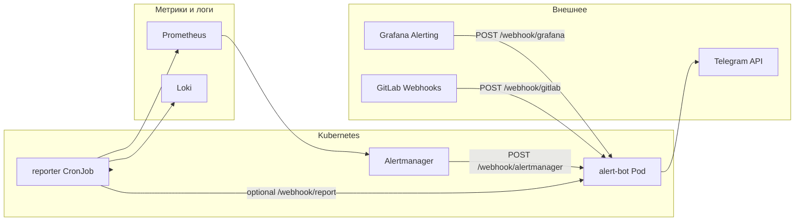
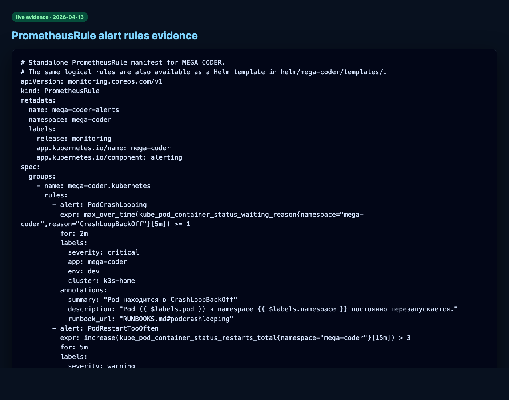
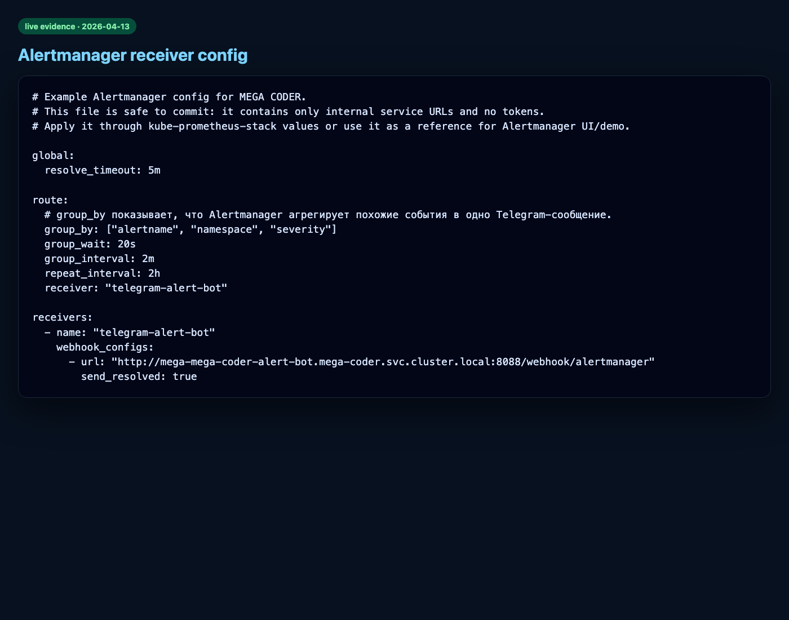
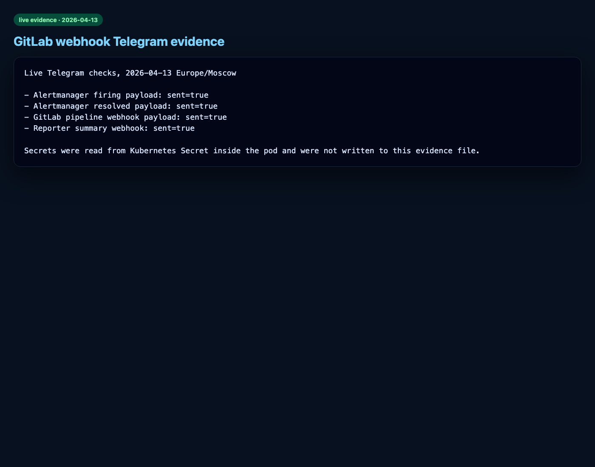
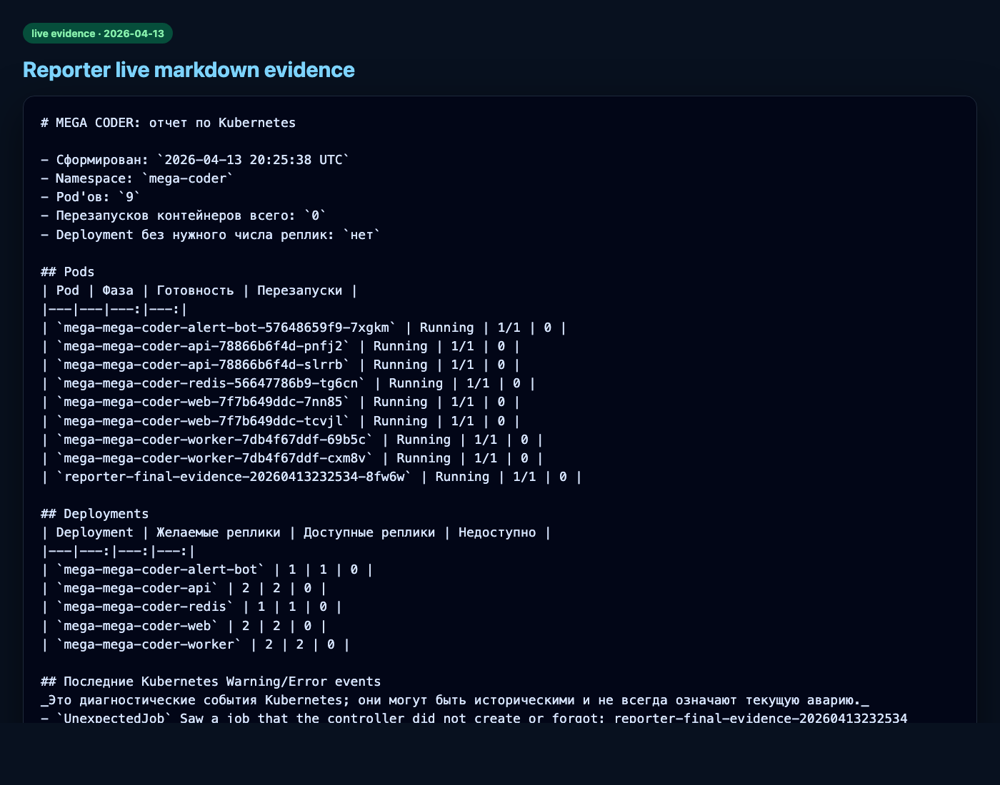
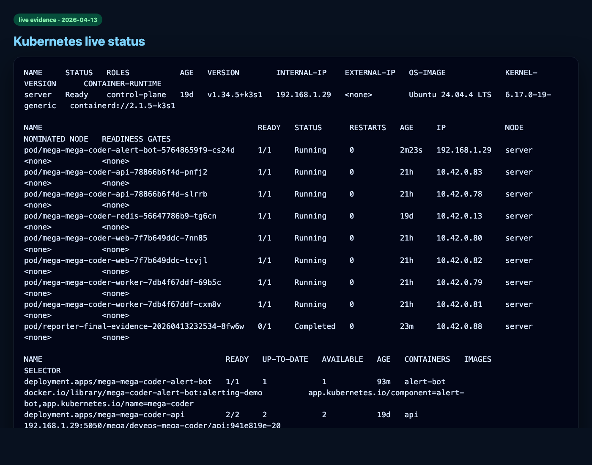
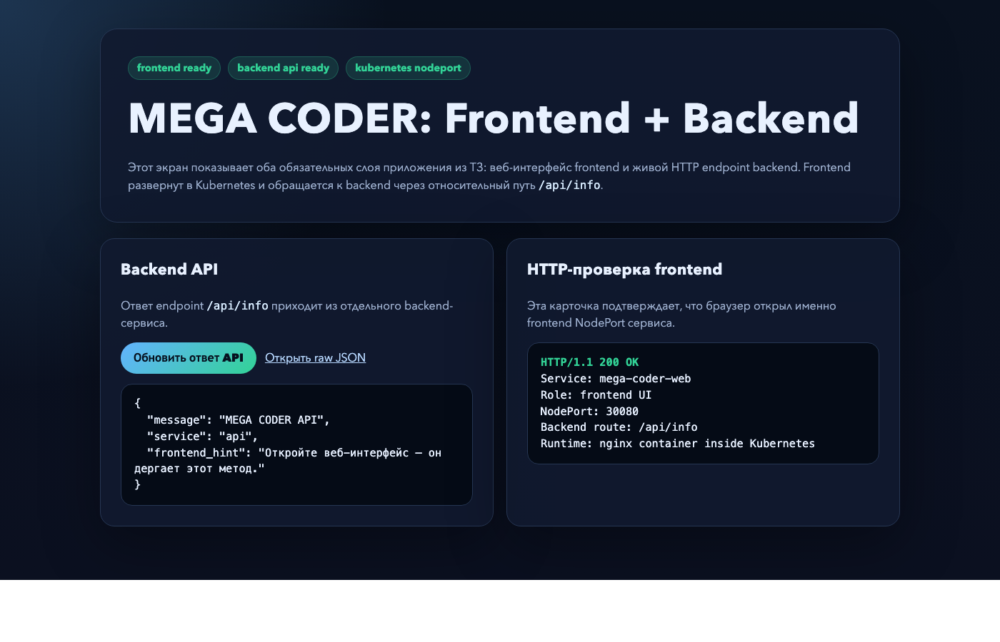

# Полный отчёт: Telegram-бот для алертов и отчётов (MEGA CODER)

**Проект:** MEGA CODER — курсовой DevOps-стенд  
**Основной Git:** **self-hosted GitLab** на **[gitlub.ru](https://gitlub.ru)** (это **не** gitlab.com) — проект [`MEGA/deveps-mega-coder`](https://gitlub.ru/MEGA/deveps-mega-coder).  
**Зеркало:** [GitHub `SERGEY-MEGA/DEVOPS_Mega-Coder`](https://github.com/SERGEY-MEGA/DEVOPS_Mega-Coder/tree/main)  
**Расположение файла:** `docs/alert-manager/TELEGRAM_ALERTING_FULL_REPORT.md`  
**Дата отчёта:** 2026-04-14  

---

## Где открыть этот файл со скриншотами

- В репозитории: **`docs/alert-manager/TELEGRAM_ALERTING_FULL_REPORT.md`** (эта папка `alert-manager`).
- На **[gitlub.ru](https://gitlub.ru/MEGA/deveps-mega-coder)** или на **GitHub**: после **push** откройте файл в браузере — картинки подтягиваются из `docs/screenshots/*.png`.  
  Команды: `git add docs/alert-manager/ docs/screenshots/ && git commit && git push` в [**gitlub.ru**](https://gitlub.ru/MEGA/deveps-mega-coder) и в [GitHub](https://github.com/SERGEY-MEGA/DEVOPS_Mega-Coder/tree/main).

**Оглавление:** [безопасность](#0-безопасность-токена) · [как создал бота](#1-как-создавался-telegram-бот-пошагово) · [что умеет](#2-что-умеет-бот-и-связанные-сервисы) · [архитектура](#3-архитектура) · [хронология проекта](#4-хронология-внедрения-в-коде) · [Helm и секреты](#5-подключение-к-kubernetes-и-helm) · [код alert-bot](#6-сервис-alert-bot) · [Prometheus / Alertmanager](#7-prometheus-и-alertmanager) · [reporter](#8-reporter) · [проверки](#9-проверка-работы) · **[фото и скриншоты](#10-скриншоты-иллюстрации)** · [ТЗ](#11-соответствие-тз) · [ссылки](#12-связанные-документы)

---

## 0. Безопасность токена

Токен бота выдаёт [@BotFather](https://t.me/BotFather) и хранится **только** в Kubernetes Secret (`mega-coder-alerting-secret`) или в переменных CI — **не** в git и не в скриншотах. Если токен когда-либо попал в чат или скрин — сделайте **Revoke** в BotFather и обновите Secret, затем перезапустите Deployment `alert-bot`. Подробно: [BOT_SETUP.md](../../BOT_SETUP.md).

---

## 1. Как создавался Telegram-бот (пошагово)

Ниже — типовой порядок действий, по которому настраивался бот для стенда (см. также [BOT_SETUP.md](../../BOT_SETUP.md)).

1. **Создание бота в Telegram**  
   - Открыть [@BotFather](https://t.me/BotFather).  
   - Команда `/newbot`.  
   - Задать отображаемое имя (например, «MEGA CODER Alerts») и **username** бота (должен заканчиваться на `bot`).  
   - BotFather возвращает **HTTP API token** — его копируют один раз и сразу кладут в безопасное место (потом только в Secret).

2. **Получение `chat_id`**  
   - Написать своему боту любое сообщение в личку (или добавить бота в группу и написать там).  
   - Локально выполнить `getUpdates` к API Telegram (см. BOT_SETUP) и из JSON взять `message.chat.id` — это и есть **`TELEGRAM_CHAT_ID`** (у групп часто отрицательный id).

3. **Секреты для webhooks**  
   - Придумать строки **`ALERTMANAGER_WEBHOOK_SECRET`** и **`GITLAB_WEBHOOK_SECRET`** — их проверяет сервис `alert-bot` в заголовках запросов, чтобы посторонние не слали фейковые уведомления.

4. **Запись в Kubernetes**  
   - Создать Secret `mega-coder-alerting-secret` в namespace `mega-coder` с ключами:  
     `TELEGRAM_BOT_TOKEN`, `TELEGRAM_CHAT_ID`, `TELEGRAM_PARSE_MODE` (обычно `HTML`), `ALERTMANAGER_WEBHOOK_SECRET`, `GITLAB_WEBHOOK_SECRET`.  
   - Команды для `kubectl` / `k3s kubectl` — в [BOT_SETUP.md](../../BOT_SETUP.md).

5. **Включение в кластере**  
   - Alerting в chart по умолчанию выключен. Включается overlay:  
     `helm upgrade ... -f helm/mega-coder/values.yaml -f examples/values-alerting-enable.yaml`.  
   - На домашнем k3s для доступа к `api.telegram.org` из пода включён **`hostNetwork: true`** у `alert-bot` (см. [examples/values-alerting-enable.yaml](../../examples/values-alerting-enable.yaml)).

6. **Связка с мониторингом**  
   - В Alertmanager настраивается **receiver** с URL на сервис `...-alert-bot:8088/webhook/alertmanager` (пример: [monitoring/alertmanager/alertmanager.yml](../../monitoring/alertmanager/alertmanager.yml)).  
   - В **GitLab на gitlub.ru** (Settings → Webhooks) указывают URL `.../webhook/gitlab` и тот же секрет в заголовке.

7. **Проверка**  
   - `GET /health` у пода, затем `scripts/smoke_alert_bot.py` с JSON из `examples/` — в ответе должно быть успешное отправление в Telegram при верных секретах (см. [DEMO_ALERTS.md](../../DEMO_ALERTS.md)).

---

## 2. Что умеет бот и связанные сервисы

В проекте бот — это не только «чат в Telegram», а **мост**: под в Kubernetes принимает HTTP webhooks и вызывает Telegram `sendMessage`.

| Возможность | Откуда данные | Что приходит в Telegram |
|-------------|----------------|-------------------------|
| Алерты Prometheus через Alertmanager | Метрики k8s/приложения, правила в `PrometheusRule` | Сгруппированное сообщение: имя алерта, namespace, pod/deployment, severity, summary/description, статус **«СРАБАТЫВАЕТ»** / **«ВОССТАНОВЛЕНО»** |
| Алерты Grafana (опционально) | Grafana Alerting | Текст по правилу, ссылки на дашборд/панель |
| События GitLab | Project webhooks | Push, pipeline (успех/ошибка), merge request, tag/release |
| Отчёт reporter | Kubernetes API + опционально Prometheus/Loki | Сводка в Markdown; при `sendReportToTelegram=true` — укороченный текст через `/webhook/report` |
| Техническое | Любой клиент | `GET /health` — жив ли сервис |

Ограничение по ТЗ: событие «новый пользователь зарегистрировался в GitLab» **не** приходит обычным project webhook — для этого нужны отдельные механизмы админки/аудита GitLab. В проекте покрыты **реальные** события репозитория (push, pipeline, MR и т.д.).

Код маршрутов: [`services/alert-bot/app/main.py`](../../services/alert-bot/app/main.py) (`/webhook/alertmanager`, `/webhook/grafana`, `/webhook/gitlab`, `/webhook/report`).

---

## 3. Архитектура



---

## 4. Хронология внедрения в коде

Кратко по [docs/alerting/SETUP_LOG.md](../alerting/SETUP_LOG.md):

1. Стенд: k3s, Helm `helm/mega-coder`, стек мониторинга, GitLab CI.  
2. Добавлен сервис **`alert-bot`** (`services/alert-bot`): FastAPI, HTML-экранирование для Telegram, retry при отправке.  
3. Добавлен **`reporter`** (`services/reporter`): отчёт по API кластера, Loki/Prometheus.  
4. В Helm: Deployment/Service `alert-bot`, CronJob reporter, PrometheusRule; alerting по умолчанию `enabled: false`.  
5. Примеры JSON и **`scripts/smoke_alert_bot.py`**.  
6. На live-стенде: Secret, образы, `helm upgrade` с `values-alerting-enable.yaml`, проверки firing/resolved и reporter.

---

## 5. Подключение к Kubernetes и Helm

- Создание Secret и команды `helm` / `k3s`: [BOT_SETUP.md](../../BOT_SETUP.md).  
- Overlay включения alerting: [examples/values-alerting-enable.yaml](../../examples/values-alerting-enable.yaml).

---

## 6. Сервис alert-bot

- Секреты только из env; пустой токен/chat_id → уведомление не уходит (`sent: false`).  
- Проверка заголовков: `X-Webhook-Secret` (Alertmanager, Grafana, report), `X-Gitlab-Token` (GitLab). Пустой секрет в env = демо без проверки.  
- Длинные тексты режутся (~3900 символов) из лимита Telegram 4096.  
- Логи `httpx` приглушены, чтобы URL с токеном не светился.

---

## 7. Prometheus и Alertmanager

Пример receiver → webhook на `alert-bot`:

```1:21:monitoring/alertmanager/alertmanager.yml
# Example Alertmanager config for MEGA CODER.
# This file is safe to commit: it contains only internal service URLs and no tokens.
# Apply it through kube-prometheus-stack values or use it as a reference for Alertmanager UI/demo.

global:
  resolve_timeout: 5m

route:
  # group_by показывает, что Alertmanager агрегирует похожие события в одно Telegram-сообщение.
  group_by: ["alertname", "namespace", "severity"]
  group_wait: 20s
  group_interval: 2m
  repeat_interval: 2h
  receiver: "telegram-alert-bot"

receivers:
  - name: "telegram-alert-bot"
    webhook_configs:
      - url: "http://mega-mega-coder-alert-bot.mega-coder.svc.cluster.local:8088/webhook/alertmanager"
        send_resolved: true
```

Правила алертов: [`monitoring/prometheus/rules/mega-coder-alerts.yaml`](../../monitoring/prometheus/rules/mega-coder-alerts.yaml).

---

## 8. Reporter

Сбор таблиц pod/deployment, событий, запросов к Prometheus, выборка `ERROR` из Loki — см. [`services/reporter/app/report.py`](../../services/reporter/app/report.py). Отправка в Telegram через `ALERT_BOT_REPORT_URL` и `/webhook/report`, если включено.

---

## 9. Проверка работы

| Файл-доказательство | Содержание |
|---------------------|------------|
| [docs/evidence/telegram-tests-live.txt](../evidence/telegram-tests-live.txt) | 2026-04-13: firing, resolved, GitLab, reporter — `sent=true` |
| [docs/evidence/alert-bot-logs-live.txt](../evidence/alert-bot-logs-live.txt) | Логи: `Telegram notification sent`, успешный POST webhook |
| [docs/evidence/reporter-live.md](../evidence/reporter-live.md) | Фрагмент Markdown-отчёта |

Повторить smoke-тест: [DEMO_ALERTS.md](../../DEMO_ALERTS.md), скрипт `scripts/smoke_alert_bot.py`.

---

## 10. Скриншоты (иллюстрации)

Файлы лежат в **`docs/screenshots/`** в репозитории. Ниже каждый снимок вынесен **отдельным блоком** — так и **gitlub.ru**, и GitHub корректно показывают картинки в Markdown (в таблицах изображения часто ломаются).

### 10.1 Grafana — правила алертов (PrometheusRule в UI)



### 10.2 Alertmanager — маршрут и receiver до webhook



### 10.3 Событие GitLab → сообщение в Telegram



### 10.4 Отчёт / сводка в Telegram (reporter)



### 10.5 Kubernetes — поды и статусы на стенде



### 10.6 Веб-интерфейс приложения (контекст стенда)



### 10.7 Дополнительно (по желанию для защиты)

Имеет смысл добавить в `docs/screenshots/` собственные снимки **из приложения Telegram** с текстом `Alertmanager: СРАБАТЫВАЕТ` и `ВОССТАНОВЛЕНО` и вставить их сюда — см. [docs/screenshots/README.md](../screenshots/README.md).

---

## 11. Соответствие ТЗ

| Требование | Реализация |
|------------|------------|
| Alertmanager + уведомления | `alertmanager.yml` → webhook → `alert-bot` → Telegram |
| Prometheus / метрики | `PrometheusRule`, алерты по k8s и целям |
| Grafana | `/webhook/grafana` |
| Логи | Loki в reporter |
| Отчёты k8s / приложения | reporter + опционально Telegram |
| GitLab | `/webhook/gitlab` (push, pipeline, MR, tag/release) |
| Конфиги, скриншоты, отчёт MD | репозиторий + этот файл |

---

## 12. Связанные документы

- [BOT_SETUP.md](../../BOT_SETUP.md) — секреты, Secret, Helm.  
- [DEMO_ALERTS.md](../../DEMO_ALERTS.md) — демонстрация firing/resolved/GitLab/reporter.  
- [REPORT_ALERTING.md](../../REPORT_ALERTING.md) — отчёт по alerting.  
- [docs/alerting/SETUP_LOG.md](../alerting/SETUP_LOG.md) — журнал внедрения.  
- [docs/alerting/REPORT_ALERTING.pdf](../alerting/REPORT_ALERTING.pdf) — PDF для сдачи.

---

**Итог:** бот создаётся через BotFather; в кластере работает сервис **`alert-bot`**, который по webhooks отправляет в Telegram алерты, события GitLab и отчёты reporter. Полный путь настройки и проверки — в [BOT_SETUP.md](../../BOT_SETUP.md) и разделах выше. Чтобы отчёт с фото был виден в веб-интерфейсе, папки **`docs/alert-manager/`** и **`docs/screenshots/`** должны быть закоммичены и запушены в [**gitlub.ru**](https://gitlub.ru/MEGA/deveps-mega-coder) и в [зеркало GitHub](https://github.com/SERGEY-MEGA/DEVOPS_Mega-Coder/tree/main).
