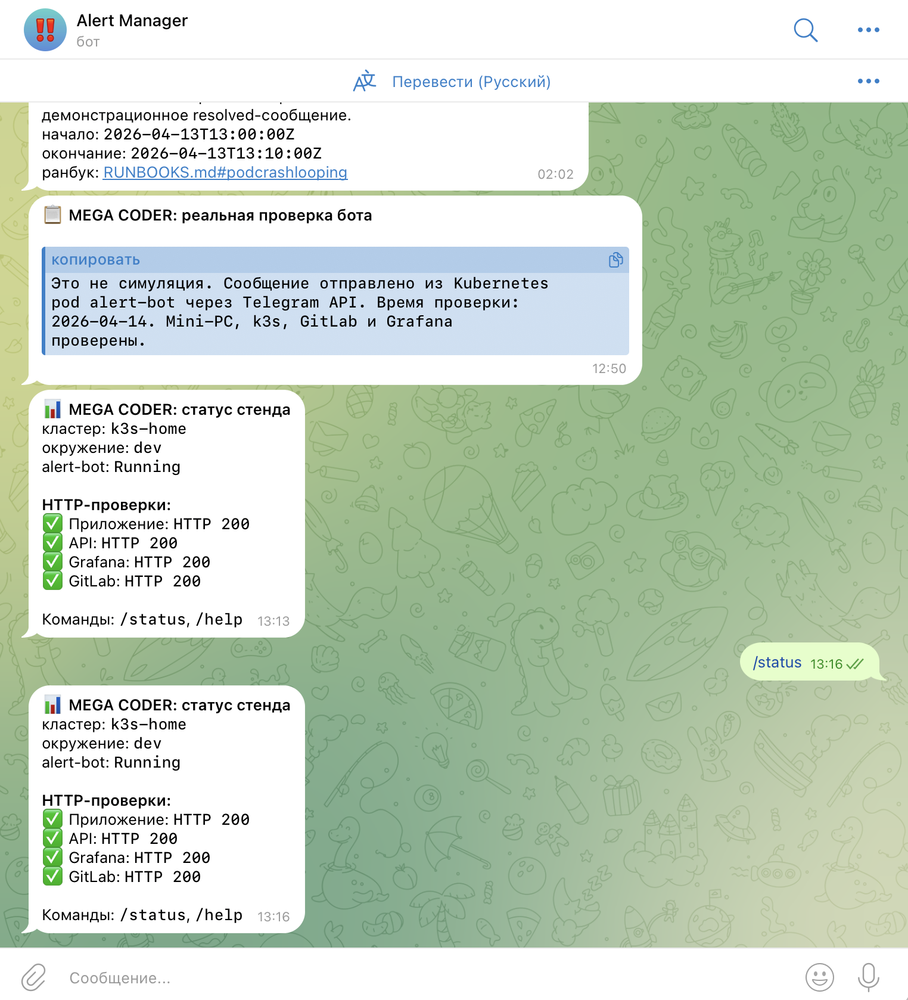

# Полный отчёт: DevOps monitoring, alerting и Telegram для MEGA CODER

Дата актуализации: 2026-04-14
Репозиторий GitHub: `https://github.com/SERGEY-MEGA/DEVOPS_Mega-Coder`
Репозиторий GitLab/gitlub: `https://gitlub.ru/MEGA/deveps-mega-coder`
Live-стенд: mini-PC `192.168.1.29`, Kubernetes/k3s namespace `mega-coder`

## 1. Цель работы

Цель доработки — показать не просто приложение, а полный DevOps-cycle: код приложения, Docker-сборку, GitLab CI/CD, Helm-деплой в Kubernetes/k3s, monitoring stack, логирование, alerting и отправку incident-уведомлений в Telegram.

Особое требование: в отчёте и репозитории не раскрываются токены, пароли, `chat_id`, kubeconfig и другие секреты. Везде используются примеры вида `<your-token>` или ссылки на Kubernetes Secret.

## 2. Краткая архитектура

Основные части стенда:

| Слой | Что используется | Где в проекте |
|---|---|---|
| Приложение | frontend, backend API, worker, Redis | `web/`, `api/`, `worker/`, Helm chart |
| CI/CD | GitLab pipeline: `pre_build`, `build`, `deploy` | `.gitlab-ci.yml` |
| Container build | Kaniko, GitLab Container Registry | `.gitlab-ci.yml`, `Dockerfile` |
| Kubernetes | k3s, namespace `mega-coder`, Deployments/Services/ConfigMap/Secret | `helm/mega-coder/` |
| Monitoring | Prometheus, Grafana, Node Exporter, kube-state-metrics | `monitoring/`, Helm release `monitoring` |
| Logging | Loki + Promtail | `monitoring/`, `services/reporter/` |
| Alerting | PrometheusRule + Alertmanager webhook receiver | `monitoring/prometheus/rules/`, `services/alert-bot/` |
| Notifications | Telegram bot через Kubernetes Secret | `services/alert-bot/`, `BOT_SETUP.md` |
| Reports | Markdown reporter по Kubernetes/Prometheus/Loki | `services/reporter/`, `docs/evidence/` |

Поток alerting:

```text
PrometheusRule -> Prometheus -> Alertmanager -> alert-bot webhook -> Telegram
GitLab webhook -> alert-bot webhook -> Telegram
Reporter job -> alert-bot webhook -> Telegram / Markdown evidence
```

## 3. Что было сделано пошагово

1. Поднят self-hosted GitLab CE на mini-PC, доступный локально по `http://192.168.1.29:8080`.
2. Создан проект `MEGA/deveps-mega-coder` в GitLab/gitlub и синхронизирован с GitHub.
3. Подготовлено приложение MEGA CODER из нескольких сервисов: backend API, frontend, worker и Redis.
4. Для сервисов добавлены Dockerfile с multi-stage подходом и запуском не от root.
5. Добавлен Helm chart `helm/mega-coder` с Deployment, Service, ConfigMap, Secret и values-параметрами.
6. Настроен GitLab pipeline: `pre_build` готовит image tag, `build` собирает образы Kaniko, `deploy` выполняет Helm upgrade.
7. Развернут Kubernetes/k3s стенд на mini-PC.
8. Развернут monitoring stack: Prometheus, Grafana, Node Exporter, kube-state-metrics, Loki и Promtail.
9. Добавлен `alert-bot`: FastAPI webhook receiver для Alertmanager, Grafana, GitLab и reporter.
10. Добавлен `reporter`: сервис для Markdown-отчёта по состоянию Kubernetes, приложения, метрик и логов.
11. Добавлены Prometheus alert rules: CrashLoop, restarts, mismatch реплик, PodNotReady, CPU/Memory, TargetDown, 5xx, Loki errors.
12. Настроена интеграция Telegram через Kubernetes Secret, без сохранения токена и `chat_id` в git.
13. Добавлена интерактивная команда Telegram `/status`: бот отвечает статусом приложения, API, Grafana и GitLab.
14. Добавлен флаг безопасности: alerting по умолчанию выключен в `values.yaml`, включается overlay-файлом `examples/values-alerting-enable.yaml`.
15. В `.gitlab-ci.yml` добавлен `--reuse-values`, чтобы обычный деплой приложения не удалял вручную включенный alerting overlay.

## 4. Безопасность секретов

Реальные значения не хранятся в репозитории. Для Telegram используются переменные:

| Переменная | Назначение |
|---|---|
| `TELEGRAM_BOT_TOKEN` | token Telegram bot |
| `TELEGRAM_CHAT_ID` | разрешенный chat id |
| `TELEGRAM_PARSE_MODE` | `HTML` |
| `ALERTMANAGER_WEBHOOK_SECRET` | shared secret для Alertmanager/Grafana/report webhook |
| `GITLAB_WEBHOOK_SECRET` | shared secret для GitLab webhook |
| `PROMETHEUS_URL` | URL Prometheus для reporter |
| `LOKI_URL` | URL Loki для reporter |

Пример команды без раскрытия секрета:

```bash
sudo k3s kubectl create secret generic mega-coder-alerting-secret \
  -n mega-coder \
  --from-literal=TELEGRAM_BOT_TOKEN="<your-telegram-token>" \
  --from-literal=TELEGRAM_CHAT_ID="<your-chat-id>" \
  --from-literal=ALERTMANAGER_WEBHOOK_SECRET="<your-webhook-secret>" \
  --from-literal=GITLAB_WEBHOOK_SECRET="<your-gitlab-webhook-secret>" \
  --dry-run=client -o yaml | sudo k3s kubectl apply -f -
```

## 5. Реализация Telegram alert-bot

Код находится в `services/alert-bot/app/main.py`.

Основные endpoints:

| Endpoint | Назначение |
|---|---|
| `GET /health` | Kubernetes healthcheck |
| `POST /webhook/alertmanager` | Основной путь для Alertmanager alerts |
| `POST /webhook/grafana` | Резервный путь для Grafana Alerting |
| `POST /webhook/gitlab` | GitLab push/pipeline/MR/tag events |
| `POST /webhook/report` | Краткий отчёт от reporter в Telegram |

Что делает bot:

- форматирует сообщения на русском языке;
- различает `critical`, `warning`, `info`;
- показывает `firing` и `resolved`;
- выводит `alertname`, namespace, pod/deployment/service/instance, summary, description, startsAt, runbook URL;
- экранирует HTML-символы для Telegram parse mode;
- делает retry и timeout при отправке;
- не пишет токены в логи;
- поддерживает команду `/status` для быстрой проверки стенда.

Команды Telegram:

```text
/help
/status
```

`/status` выполняет лёгкие HTTP-проверки:

- приложение: `http://127.0.0.1:30080/`;
- API: `http://127.0.0.1:30080/api/info`;
- Grafana: `http://127.0.0.1:30030/login`;
- GitLab: `http://127.0.0.1:8080/users/sign_in`.

На live-стенде команда включена только через overlay `examples/values-alerting-enable.yaml`:

```yaml
alerting:
  alertBot:
    enableCommands: true
```

## 6. Настройка PrometheusRule и Alertmanager

Prometheus rules лежат в:

```text
monitoring/prometheus/rules/mega-coder-alerts.yaml
helm/mega-coder/templates/prometheusrule-alerts.yaml
```

Реализованные правила:

| Alert | Severity | Что означает |
|---|---|---|
| `PodCrashLooping` | critical | pod перезапускается в CrashLoopBackOff |
| `PodRestartTooOften` | warning | слишком много restart за короткое время |
| `DeploymentReplicasMismatch` | critical | доступно меньше реплик, чем ожидается |
| `PodNotReady` | warning | pod долго не готов |
| `HighCPUUsage` | warning | высокая CPU-нагрузка |
| `HighMemoryUsage` | warning | высокая RAM-нагрузка |
| `TargetDown` | critical | Prometheus target недоступен |
| `TooMany5xx` | warning | много HTTP 5xx, если есть ingress metrics |
| `LokiErrorSpike` | warning | всплеск ERROR в логах, если включен Loki ruler |

Alertmanager config example:

```text
monitoring/alertmanager/alertmanager.yml
```

Он маршрутизирует alerts на webhook:

```text
http://mega-mega-coder-alert-bot.mega-coder.svc.cluster.local:8088/webhook/alertmanager
```

## 7. GitLab events

GitLab project webhook может отправлять:

- push events;
- pipeline success/failed;
- merge request events;
- tag push events.

Событие `new user registered` стандартным project webhook не отдаётся, поэтому в проекте оно честно не заявлено как реализованное. Для защиты показывается реальная интеграция через pipeline/push/MR events.

Webhook endpoint:

```text
/webhook/gitlab
```

Секрет передаётся через header `X-Gitlab-Token`, значение хранится в Kubernetes Secret.

## 8. Reporter и анализ состояния

Reporter находится в `services/reporter/`.

Он собирает:

- состояние pod'ов;
- restart count;
- unavailable deployments;
- Warning/Error events;
- краткую сводку приложения;
- CPU/memory/availability через Prometheus, если URL доступен;
- ERROR-сэмплы из Loki, если URL доступен.

Reporter оформлен как Kubernetes CronJob, но для демонстрации его лучше запускать вручную:

```bash
sudo k3s kubectl create job -n mega-coder --from=cronjob/mega-mega-coder-reporter reporter-manual-demo
sudo k3s kubectl logs -n mega-coder job/reporter-manual-demo
```

Live-пример сохранён в:

```text
docs/evidence/reporter-live.md
```

## 9. Live-состояние стенда на 2026-04-14

Актуальные evidence-файлы:

| Evidence | Файл |
|---|---|
| Kubernetes objects | `docs/evidence/k3s-status-live.txt` |
| Helm values/status | `docs/evidence/helm-release-live.txt` |
| HTTP smoke test | `docs/evidence/http-smoke-live.txt` |
| Alert bot logs | `docs/evidence/alert-bot-logs-live.txt` |
| Telegram smoke tests | `docs/evidence/telegram-tests-live.txt` |
| Reporter live report | `docs/evidence/reporter-live.md` |

Контрольные результаты:

```text
app:200
api:200
grafana:200
gitlab:200
```

Helm release после восстановления alerting overlay:

```text
NAME: mega
NAMESPACE: mega-coder
STATUS: deployed
REVISION: 24
```

В Kubernetes видны:

- `mega-mega-coder-api` — 2/2;
- `mega-mega-coder-web` — 2/2;
- `mega-mega-coder-worker` — 2/2;
- `mega-mega-coder-redis` — 1/1;
- `mega-mega-coder-alert-bot` — 1/1;
- `mega-mega-coder-reporter` — CronJob;
- `mega-mega-coder-alerts` — PrometheusRule.

## 10. Скриншоты

### 10.1 Приложение: frontend + backend


На скриншоте видно, что frontend доступен и получает ответ от backend endpoint `/api/info`.

### 10.2 Kubernetes evidence


Скриншот показывает live-вывод Kubernetes: node Ready, pods Running, Deployments/Services/ConfigMap/Secret.

### 10.3 Grafana alert rules


На скриншоте показан раздел Grafana/Alerting или evidence по alert rules.

### 10.4 Alertmanager config


На скриншоте показан YAML/receiver для маршрутизации alerts в alert-bot.

### 10.5 GitLab event message


Скриншот подтверждает проверку GitLab webhook notification.

### 10.6 Reporter в Telegram


Скриншот показывает отправку краткого отчёта reporter в Telegram.

### 10.7 Интерактивная команда `/status`



На свежем скриншоте видно, что это не симуляция: пользователь отправляет `/status`, а бот отвечает на русском языке и показывает HTTP 200 для приложения, API, Grafana и GitLab.

### 10.8 Интерактивные команды `/help` и `/status`


На втором скриншоте видно полный сценарий ручной проверки: пользователь пишет `/help`, бот объясняет назначение и отсутствие секретов в git, затем пользователь пишет `/status`, и бот снова возвращает актуальный статус стенда.

## 11. Команды для демонстрации на защите

Проверить Kubernetes:

```bash
ssh mega@192.168.1.29
sudo k3s kubectl get nodes -o wide
sudo k3s kubectl get pods -n mega-coder -o wide
sudo k3s kubectl get deploy,svc,cronjob,prometheusrule -n mega-coder
```

Проверить Helm:

```bash
sudo env KUBECONFIG=/etc/rancher/k3s/k3s.yaml helm status mega -n mega-coder
sudo env KUBECONFIG=/etc/rancher/k3s/k3s.yaml helm get values mega -n mega-coder
```

Проверить приложение:

```bash
curl -I http://192.168.1.29:30080/
curl http://192.168.1.29:30080/api/info
```

Проверить Grafana и GitLab:

```bash
curl -I http://192.168.1.29:30030/login
curl -I http://192.168.1.29:8080/users/sign_in
```

Проверить alert-bot:

```bash
sudo k3s kubectl logs -n mega-coder deploy/mega-mega-coder-alert-bot --tail=50
```

Показать Telegram:

```text
/status
```

## 12. Сценарий рассказа на 2 минуты

1. “Это DevOps-проект MEGA CODER. В репозитории есть приложение из нескольких сервисов: frontend, backend API, worker и Redis.”
2. “CI/CD описан в `.gitlab-ci.yml`: сначала `pre_build` готовит tag Docker-образов, потом Kaniko собирает и push'ит образы, затем Helm деплоит их в k3s.”
3. “Kubernetes часть оформлена Helm chart'ом: namespace, Deployment, Service, ConfigMap, Secret, отдельные values для параметризации.”
4. “Monitoring stack включает Prometheus, Grafana, Node Exporter, kube-state-metrics, Loki и Promtail.”
5. “Для alerting добавлены PrometheusRule и alert-bot. Alertmanager отправляет webhook в bot, а bot отправляет русские уведомления в Telegram.”
6. “Секреты не лежат в git: token и chat_id хранятся в Kubernetes Secret.”
7. “Для демонстрации можно написать боту `/status`, и он проверит приложение, API, Grafana и GitLab.”

## 13. Что показать преподавателю

1. Открыть GitLab/gitlub проект и показать `README.md`, `PROJECT_MAP.md`, `.gitlab-ci.yml`.
2. Открыть `services/alert-bot/app/main.py` и показать endpoints `/webhook/alertmanager`, `/webhook/gitlab`, `/webhook/report`.
3. Открыть `helm/mega-coder/values.yaml` и показать, что alerting выключен по умолчанию, а включается overlay.
4. Открыть `examples/values-alerting-enable.yaml` и показать `enabled: true`, `enableCommands: true`.
5. Открыть приложение: `http://192.168.1.29:30080`.
6. Открыть Grafana: `http://192.168.1.29:30030`.
7. Открыть Telegram и написать `/status`.
8. В терминале показать `kubectl get pods -n mega-coder -o wide`.

## 14. Важное замечание по CI/CD и alerting overlay

Alerting сделан безопасно и изолированно. В базовом `helm/mega-coder/values.yaml` стоит:

```yaml
alerting:
  enabled: false
```

Для live-демонстрации применяется overlay:

```bash
sudo env KUBECONFIG=/etc/rancher/k3s/k3s.yaml helm upgrade --install mega ./helm/mega-coder \
  -n mega-coder \
  --reuse-values \
  -f examples/values-alerting-enable.yaml
```

В `.gitlab-ci.yml` добавлен `--reuse-values`, чтобы обычный deploy приложения не удалял alerting-компоненты, если они уже вручную включены на стенде.

## 15. Возможные проблемы и решение

| Проблема | Решение |
|---|---|
| Telegram не отвечает | Проверить Secret, что пользователь написал боту `/start`, и что в логах есть `Telegram command polling enabled` |
| `/status` не приходит | Проверить `TELEGRAM_CHAT_ID`; бот отвечает только разрешенному чату |
| Alert-bot исчез после deploy | Применить overlay и убедиться, что CI использует `--reuse-values` |
| Grafana dashboard пустой | Выбрать правильный namespace `mega-coder` и datasource Prometheus |
| GitLab webhook не работает | Проверить `X-Gitlab-Token` и endpoint `/webhook/gitlab` |
| Reporter не отправляет Telegram | Проверить `sendReportToTelegram` и доступ к alert-bot service |

## 16. Вывод

В проекте реализован production-like DevOps контур: приложение собрано в Docker images, доставляется GitLab CI/CD через Helm в Kubernetes/k3s, наблюдается через Prometheus/Grafana/Loki, а события и отчёты отправляются в Telegram через отдельный webhook-сервис. Отдельно подготовлены Markdown/PDF отчёт, evidence-файлы и скриншоты для защиты.
